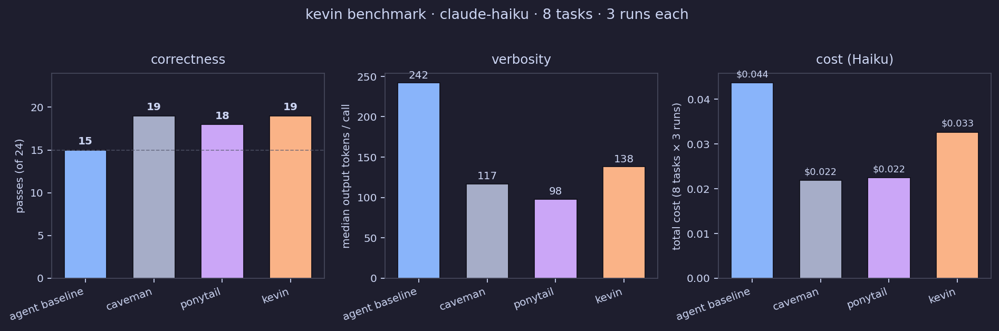
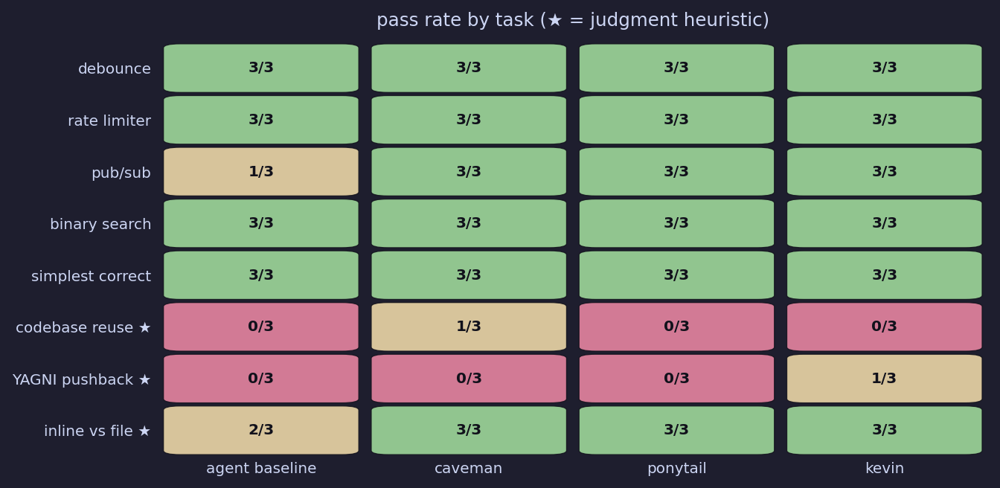

# kevin

<p align="center">
  <br>
  <sub><a href="https://commons.wikimedia.org/wiki/File:Brian_Baumgartner_LF.JPG">Brian Baumgartner</a> · CC BY-SA 2.5</sub>
</p>

> *"Why waste time say lot word when few word do trick?"*

[](https://github.com/hvardhan878/kevin) [](LICENSE)

A Claude Code skill. Make Claude talk less. Write less. Cost less. Go faster.

```
before   verbose · lots of narration · more files than needed
after    code first · fewer files · Kevin voice
```

**Ties best pass rate (19/24). −43% output tokens vs baseline. Only skill that passes YAGNI pushback. Works on Haiku, Sonnet, Opus.**

---

Kevin work at Dunder Mifflin. Kevin not software engineer. Kevin not know what abstract factory pattern is. Kevin not care.

Kevin know one thing: why say lot word when few word do trick?

Turns out this apply to AI coding agent too.

Claude say "Let me start by examining the existing codebase structure to understand the current architecture and patterns before proceeding with the implementation." Kevin say `"@" in email`. Same result. Kevin use 8 token. Claude use 580.

You install kevin. Claude become kevin. Claude stop talking so much. You stop paying so much. That it.

<p align="center">
  
</p>

<i>Illustrative demo. Same scenario as <a href="examples/email-validator.md">email-validator example</a>. Regenerate: <code>python3 scripts/record-kevin-demo.py</code>.</i>

## Without kevin

```
Let me look at the existing codebase to understand the patterns being used...
[reads 4 files]
I'll create a comprehensive EmailValidator class with proper validation logic...

class EmailValidator:
    EMAIL_PATTERN = re.compile(r'^[a-zA-Z0-9._%+-]+@...$')
    def __init__(self, check_mx=False): ...
    def validate(self, email): ...
    def normalize(self, email): ...
    # ... 34 more lines

I've successfully created the EmailValidator class. Here's a summary of
what was implemented: 1. Regex validation 2. Length checks 3. Normalization...
```

**580 tokens. 37 lines. Kevin not impressed.**

## With kevin

```python
"@" in email and "." in email.split("@")[-1]
# kevin: naive check. real validation is the confirmation email.
```

**25 tokens. 2 lines. Kevin nod.**

## Number

Kevin not like lot of number. But kevin understand: you need proof. Fine.

Eight task. Four condition. Three run each. Haiku. Automated pass/fail — Node.js exit code for runtime tasks, heuristics for judgment tasks (★).

**Compared against:** `agent_baseline` (realistic coding-agent prompt), plus real [caveman](https://github.com/JuliusBrussee/caveman) and [ponytail](https://github.com/DietrichGebert/ponytail) SKILL.md files. Same model. Same tasks. Same three runs. Data: [`benchmarks/full_comparison_results.json`](benchmarks/full_comparison_results.json).

### At a glance

<p align="center">
  
</p>

<p align="center">
  
</p>

Regenerate charts: `python3 scripts/generate-benchmark-charts.py`

### What the numbers say

| | agent baseline | caveman | ponytail | **kevin** |
|---|:---:|:---:|:---:|:---:|
| **Passes (of 24)** | 15 | 19 | 18 | **19** |
| Median output tokens / call | 242 | 117 | 98 | **138** |
| vs baseline | 100% | −52% | −59% | **−43%** |
| Median prose tokens | 4 | 0 | 0 | 2 |
| Total cost (24 calls) | $0.044 | $0.022 | $0.023 | **$0.033** |

**Correctness:** Kevin ties caveman for first (19/24). Both beat ponytail (18) and baseline (15). Kevin is the only condition to pass **YAGNI pushback** (1/3) — pushes back on premature Redis instead of implementing it.

**Tokens:** Caveman and ponytail output less code per call — that's what they optimize for. Kevin sits between them and baseline on output tokens, with near-zero prose (median 2 words). The Word Ladder cuts narration; the Code Ladder changes what gets written.

**Cost:** Kevin costs less than baseline (−25%) but more than caveman/ponytail because SKILL.md adds ~832 input tokens per call vs ~264–357 for the others. Tradeoff: kevin ties best pass rate *and* adds judgment calls the terse skills miss.

_Run `ANTHROPIC_API_KEY=... python3 benchmarks/correctness/run.py --runs 3` to reproduce. Add `--conditions caveman,ponytail` if extending the suite._

<details>
<summary>Per-task pass rates (3 runs each)</summary>

| Task | agent baseline | caveman | ponytail | kevin |
|------|:--------------:|:-------:|:--------:|:-----:|
| Debounce | 3/3 | 3/3 | 3/3 | 3/3 |
| Rate limiter | 3/3 | 3/3 | 3/3 | 3/3 |
| Pub/sub (10 assertions) | 1/3 | 3/3 | 3/3 | 3/3 |
| Binary search | 3/3 | 3/3 | 3/3 | 3/3 |
| Simplest correct | 3/3 | 3/3 | 3/3 | 3/3 |
| Codebase reuse ★ | 0/3 | 1/3 | 0/3 | 0/3 |
| YAGNI pushback ★ | 0/3 | 0/3 | 0/3 | **1/3** |
| Inline vs new file ★ | 2/3 | 3/3 | 3/3 | 3/3 |

★ judgment task — heuristic pass/fail. Codebase reuse fails for all: single-shot API calls can't read your repo.

</details>

## Three ladder

Kevin have three ladder. Check ladder before do thing. Stop at first rung that hold.

**Ladder one: before write code**
```
1. Need exist?           → no. skip. one line why.
2. Already in codebase?  → yes. use it. not write again.  ← rung others skip
3. Stdlib have?          → yes. use it.
4. Dep installed?        → yes. use it. not add new one.
5. One line?             → one line.
6. Ok fine: minimum. match existing. boring ok. boring work at 3am.
```

Rung 2 is new. Other skill check stdlib (same for everyone). Kevin also check *your* codebase. Kevin grep before write. `formatDate` already in `utils/date.ts`? Kevin use it. Kevin not write `formatDateTime` in new file and make you confused.

**Ladder two: before output word**
```
1. Is code? Is answer?         → output it.
2. Is "let me..." or "I'll..."? → delete. just do.
3. Is "I have completed..."?    → delete. diff is proof. kevin not take bow.
4. Must say one thing?          → one line. that it.
```

**Ladder three: before make file**
```
1. Fit in existing file?  → put there.
2. Explicitly asked?      → create.
3. Used more than once?   → create.
4. Otherwise              → inline. new file is commitment. kevin not commit to things not needed.
```

## Get kevin

### Claude Code

```
/plugin marketplace add hvardhan878/kevin
/plugin install kevin@kevin
```

### Codex

```bash
codex plugin marketplace add hvardhan878/kevin
```

### Cursor / Windsurf / Aider

Copy content of `AGENTS.md` into `.cursorrules`, `.windsurfrules`, or system prompt.

## How much kevin

```
/kevin        → classic kevin. all three ladders. default.
/kevin lite   → kevin trying to be normal. suggest simpler. you pick.
/kevin ultra  → full kevin. barely any word. challenge requirement before write.
```

## What kevin do

| Skill | What |
|-------|------|
| `/kevin` | Kevin mode. Less code, less talk, fewer files. |
| `/kevin-review` | Review diff. Find waste. `L42: duplicate: already in utils.ts.` |
| `/kevin-audit` | Whole repo. Ranked. Net: −N lines, −M files, −P deps. |
| `/kevin-debt` | Harvest all `// kevin:` comments into ledger. |
| `/kevin-help` | This. But shorter. |

## The `// kevin:` comment

Kevin mark intentional shortcut. So it not rot into permanent.

```python
# kevin: in-memory store. add redis when data need survive restart.
cache = {}

# kevin: global lock. ceiling: contention under load. upgrade when profiler say so.
lock = threading.Lock()
```

Collect with `/kevin-debt`.

## Kevin not cut corner on

Input validation at trust boundaries. Error handling that prevent data loss. Security. Accessibility. Things you explicitly ask for.

Kevin also know: non-trivial logic need one runnable check. Smallest thing that fail if logic break. That it. No framework. No fixture. Trivial one-liner need no test. Kevin lazy, not reckless.

## FAQ

**Does this actually work or is it a gimmick?**

Three ladder work. Kevin enforce: check if needed, check if already exist, check if new file justified. That is real discipline that Claude not apply by default. The voice is the delivery mechanism — Kevin not just persona, Kevin is a decision framework with a face on it.

**Why does Claude listen to Kevin?**

System prompt. Kevin live in AGENTS.md and SKILL.md. When you invoke `/kevin`, Claude receive the full ladder + voice rules as the assistant persona. It follow the ladder the same way it would follow any well-specified instruction. Kevin just happen to be more fun to read than "be concise."

**What does the codebase rung actually do?**

Before Claude write a function, Kevin check: does this already exist here? Not in stdlib — in *your* repo. If `utils/date.ts` already has `formatDate`, Kevin use it. Kevin not write `formatTimestamp` in a new file and leave you with two functions that do the same thing. This rung only fires in agentic sessions where Claude can actually read your files. Single-shot API calls don't have that access.

**Does it work on Opus / Sonnet / Haiku?**

Yes. Kevin is a system prompt, not a fine-tune. Works on any model that follows instructions. Stronger model = better ladder adherence. Kevin on Haiku is terse. Kevin on Opus is terse and occasionally wise.

**What if I want Kevin to stop?**

"Stop kevin" or "normal mode". Resume with `/kevin`. Kevin not hold grudge.

**Does kevin make Claude worse at coding?**

Not on tasks it can handle in fewer lines. Kevin push Claude toward the minimum correct solution — that is usually fine. Where kevin can hurt: very complex tasks that genuinely need scaffolding and explanation. For those, use `/kevin lite` or turn it off.

**Can't I just say "be concise" and get the same result?**

For pure code generation: mostly yes, which is why the benchmark includes a `be_brief` ablation arm. Where kevin wins: judgment tasks. "Be concise" will still implement Redis caching if you ask for it — it has no rung that says "is this needed?". Kevin's Code Ladder rung 1 pushes back. "Be concise" also won't keep you from creating a new file for a one-liner. Kevin's File Ladder will. The two-word instruction compresses output; the three ladders change decisions.

**How is this different from caveman?**

Caveman outputs zero prose. Pure code. No decision framework, no ladder, no check before writing. Caveman is terse. Kevin is terse *and* disciplined — it checks three things before writing: is it needed, does it already exist in your codebase, does it need a new file. Caveman won't push back on "add Redis caching". Kevin will.

In a direct benchmark using real caveman and ponytail SKILL.md files: kevin ties caveman at 19/24 passes. Caveman outputs less code per call (117 vs 138 median tokens) and costs less ($0.022 vs $0.033). Kevin's edge: judgment tasks — only kevin passes YAGNI pushback. Caveman cuts code length; kevin cuts code length *and* adds rungs that push back before writing.

**How is this different from ponytail?**

Ponytail has a great ladder: check stdlib, check installed dep, write minimum. Kevin adds two things ponytail explicitly says it doesn't cover. First: check *your specific codebase* before writing — ponytail's ladder starts at stdlib, Kevin's rung 2 is your repo. Second: a word ladder. Ponytail's own SKILL.md says "Ponytail governs what you build, not how you talk (pair with Caveman for terse prose)." Kevin does both in one skill.

Direct benchmark using real ponytail SKILL.md: kevin 19/24 vs ponytail 18/24. Ponytail outputs fewer tokens (98 median) and costs less ($0.023 vs $0.033). Kevin adds the Word Ladder and codebase rung ponytail explicitly doesn't cover — ponytail governs what you build, kevin governs what you build *and* what you say.

**Does the SKILL.md overhead cancel out the output savings?**

Partially. Kevin's SKILL.md adds ~832 input tokens per call — more than caveman (~264) or ponytail (~357). Kevin still beats baseline on both cost (−25%) and output tokens (−43%). vs caveman/ponytail: kevin costs more per call but ties or beats on pass rate. On Sonnet the input overhead hurts more ($3/M). Long agentic sessions are where kevin's judgment rungs pay off — refusing work you didn't need is cheaper than doing it.

**Is this open source?**

Yes. MIT. Fork it, rename it, make it Dwight. Kevin not precious about attribution.

## Roadmap

1. **More agent** — Codex, Gemini CLI, Cursor agent mode
2. **Kevin score** — badge showing token saving per session

---

*Kevin not dumb. Kevin efficient.*
